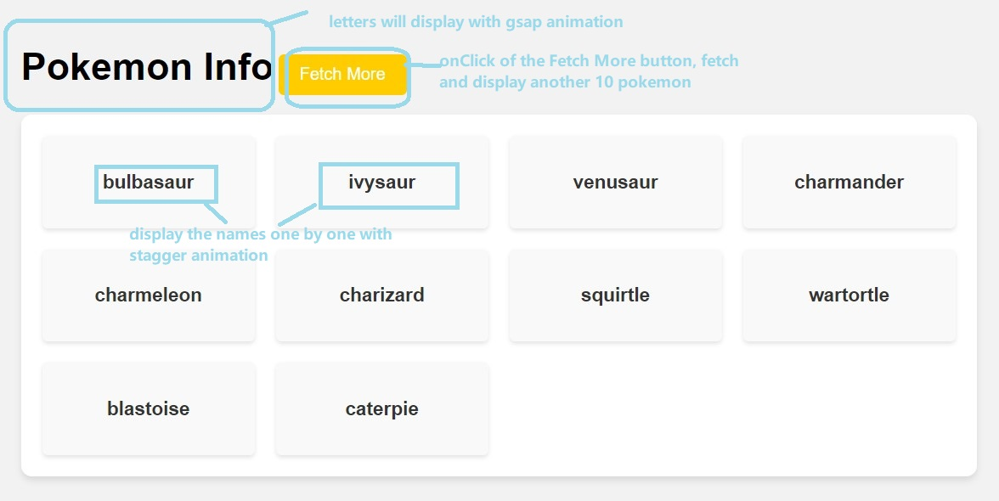
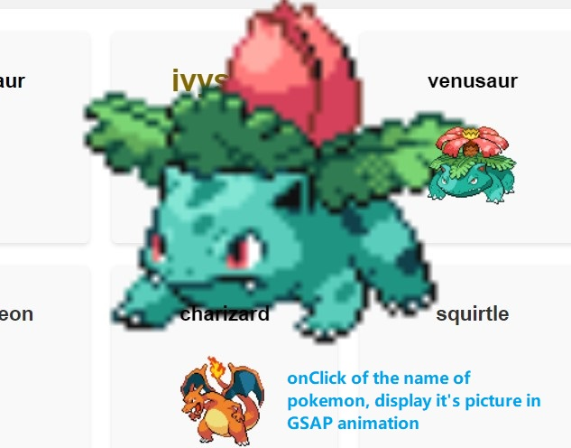
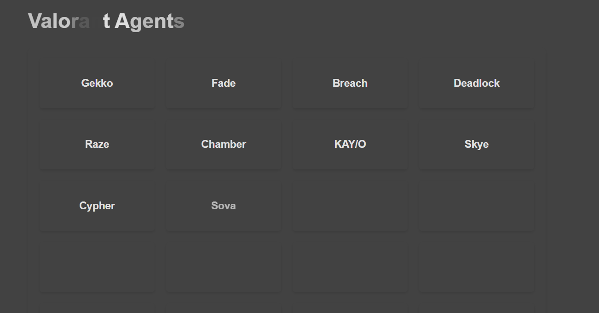
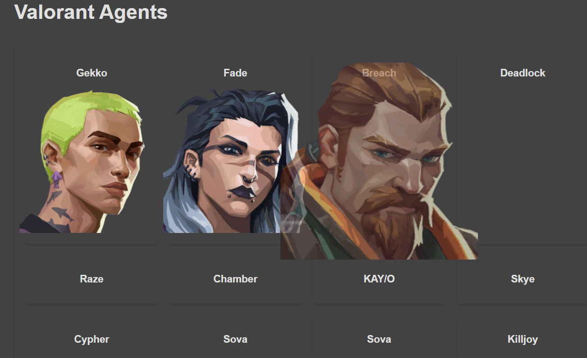

## Assignment: Animating Pokémon/Valorant List using GSAP

**Objective:** In this assignment, you will use the GreenSock Animation Platform (GSAP) to fetch data from the PokeAPI/Valorant API and create animations to display a list of Pokémon/Valorant Agents.

**Requirements for Pokemon API:**


1.(Basic) use either fetch or Ajax to fetch 10 pokemon and populate their names on the page

2.(Basic) When click on the fetch more button, the offset will increase by 10 and fetch another 10 pokemon.



3.(Intermediate) When click on the pokemon card, fetch and display the picture of the specific pokemon under the name



4.(Basic) add GSAP animations when displaying "Pokemon Info"

5.(Basic) add GSAP animations when displaying the name

6.(Intermediate) add GSAP animations when click on the pictures.


**Instructions:**

- Step 1: Set Up HTML and Include GSAP

Create an HTML file named index.html.
Inside the <head> tag, include the GSAP library using the following code:
```js
    <script src="https://cdnjs.cloudflare.com/ajax/libs/gsap/3.12.2/gsap.min.js"></script>

```

- Step 2: Create HTML Structure

In the <body> of your HTML file, create a <ul> element with an id of pokemonList.


- Step 3: Write JavaScript Code

Step 4: Testing and Submission

- Save your HTML file.
- Open the HTML file in a web browser to see the animations in action.
- Ensure that the Pokémon Info and Pokémon names fade in with a staggered effect.
- For advanced students try intermediate requirements and challenges.

Hint 1:

Option 1:  Write an asynchronous function fetchPokemonData() that fetches data from the PokeAPI. This function should return an array of Pokémon data.


```js
async function fetchPokemonData(offset) {
  // Fetch data from the PokeAPI
  url: `https://pokeapi.co/api/v2/pokemon?offset=${offset}&limit=10`,
  const data = await response.json();
  return data.results;
}


```

Option 2: Use jQuery Ajax to fetch data from the PokeAPI. 

```js
const fetchPokemonList = (offset) => $.ajax({
        method: "GET",
        url: `https://pokeapi.co/api/v2/pokemon?offset=${offset}&limit=10`,
        contentType: "application/json",

        success: function(data) {
            console.log(offset);
            console.log("the pokemon list ", data.results);
         
         // your code
          
                  
                
            } else {
                console.log("no more pokemon");
            }
            
        // onclick of the pokemonCard, fetch image and display 
          // your code

           
        },

        error: function(error) {
            console.log(error);
            return error;
        }
    })

```


Challenge (Optional):

- Enhance the animation by adding more properties such as scaling, rotation, or color changes to the Pokémon list items.

- Add scroll animation to the fetch more button. Wherever you scroll the button should be visible.

- Display other properties.


**Requirements for Valorant API:**

 
1.(Basic) use either fetch or Ajax to fetch agents and populate their names on the page

```
https://valorant-api.com/v1/agents
```



3.(Basic) When click on the agent card, display the picture of the specific agent under the name



4.(Basic) add GSAP animations when displaying "Valorant agent"

5.(Basic) add GSAP animations when displaying the name

6.(Basic) add GSAP animations when click on the pictures.

_instructions are same as pokemon API_

Challenge (Optional):

- Enhance the animation by adding more properties such as scaling, rotation, or color changes to the agent list items.

- Display other properties.